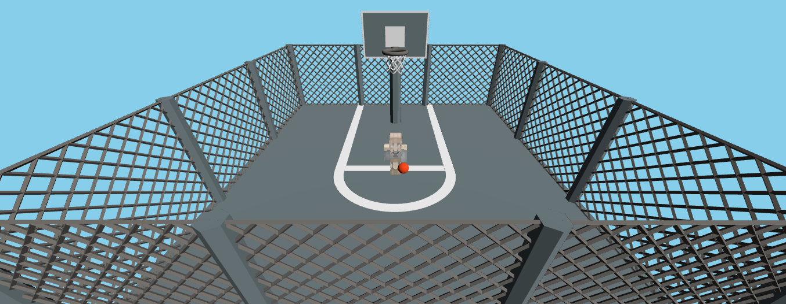
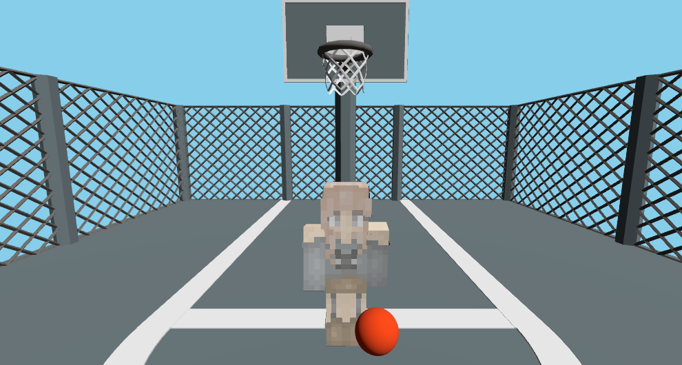
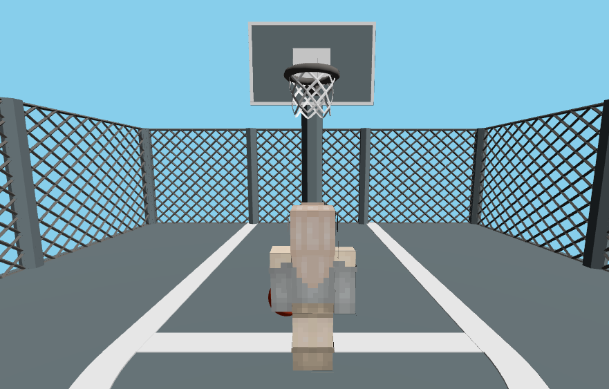
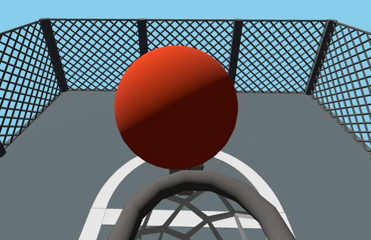

# Proyecto Three.js: Animación de Personaje con Tween.js y Seguimiento - Temática baloncesto

## Introducción

Este proyecto implementa un prototipo en **Three.js** que combina animación de personajes, seguimiento de cámara y lanzamiento de objetos. El objetivo principal es explorar **fotogramas clave**, animaciones con **Tween.js** y estructuras articuladas en un entorno 3D.

Se utilizan elementos dinámicos como la posición y orientación del personaje, la cámara y la pelota, permitiendo experimentar con movimiento, interacción y animaciones jerárquicas.

---

## Características del Código

1. **Escena y Cámara**

   * Escena principal con fondo azul (`0x87ceeb`) simulando un cielo.
   * Cámara en perspectiva (`PerspectiveCamera`) con posibilidad de alternar entre cuatro modos:

     * `1`: Cámara por defecto.
     * `2`: Cámara frontal del jugador.
     * `3`: Cámara trasera del jugador.
     * `4`: Cámara de seguimiento de la pelota.
    
| Cámara             | Imagen                                    |
| ------------------ | ----------------------------------------- |
| Por defecto        |  |
| Frontal jugador    |       |
| Trasera jugador    |   |
| Seguimiento pelota |         |

2. **Renderizado y Luces**

   * Renderizador WebGL con antialiasing.
   * Luz direccional y luz ambiental (`DirectionalLight` y `AmbientLight`) para iluminación general de la escena.

3. **Jugador**

   * Modelo de personaje basado en **Minecraft**, utilizando `PlayerObject` de `skinview3d`.
   * Skin del personaje: [FadedKitty](https://www.minecraftskins.net/fadedkitty).
   * Posibilidad de rotar y mover el personaje con las teclas `WASD` y `R/T` para rotación.
   * Animaciones de brazos y piernas durante movimiento (`walk`) y estado idle.
   * Animación específica de levantar brazos al lanzar la pelota.

4. **Pelota**

   * Esfera con material estándar, lanzable con clic del ratón.
   * Movimiento interpolado mediante **Tween.js** para simular parábola de lanzamiento.
   * La cámara puede seguir automáticamente la pelota durante el vuelo.

5. **Tween.js**

   * Uso de **fotogramas clave** y tweening para animaciones suaves.
   * Animación de brazos del jugador al lanzar la pelota con interpolación de rotaciones.
   * Animaciones de rotación del personaje con suavizado (`Quadratic.Out`).

6. **Colisiones**

   * Detección básica de colisiones con los límites de la cancha (`Box3`) y los objetos de la misma.
   * Evita que el jugador atraviese los muros o salga del área de juego.

7. **Recursos**

   * Modelo de cancha: [Basketball Court en Sketchfab](https://sketchfab.com/3d-models/basketball-court-81f4d6a4777f4225b2afe10b06ae4e5b)
   * Skin del personaje: [FadedKitty](https://www.minecraftskins.net/fadedkitty)

8. **Interacción**

   * Movimiento con teclado `WASD`.
   * Rotación con `R` y `T`.
   * Lanzamiento de pelota con clic del ratón.
   * Cambio de cámara con teclas `1-4`.

---

## Estructura de Archivos

```
/project-root
├─ index.html
├─ basketball.js           # Código principal (el que proporcionaste)
├─ /src
│  ├─ court.glb      # Modelo 3D de la cancha
│  ├─ skin1.png      # Skin del jugador
└─ README.md
```

---

## Conceptos Implementados

1. **Fotogramas Clave y Tweening**

   * Tween.js permite interpolar valores entre estado inicial y final, creando animaciones suaves.
   * Se usa para animar:

     * Rotación del personaje.
     * Movimiento de brazos al lanzar la pelota.
     * Trayectoria de la pelota.

2. **Estructuras Articuladas**

   * Los brazos y piernas del personaje están representados como huesos (`Bone`) de un `SkinnedMesh`.
   * Permite animaciones independientes de cada extremidad.

3. **Cinemática Básica**

   * La pelota sigue una trayectoria parabólica.
   * La cámara puede seguir la pelota en tiempo real con interpolación suave (`lerp`).

---


## Video de demostración


<p align="center">
  <a href="https://www.youtube.com/watch?v=WrauvVJRN6U" target="_blank">
    
  </a>
</p>

---

## Tarea y Objetivo

El prototipo cumple con la entrega requerida:

* Integración de **Tween.js** para animaciones de fotogramas clave.
* Interacción dinámica de personaje y objeto lanzable (pelota).
* Uso de **estructura articulada** con brazos y piernas animables.
* Manejo de cámaras múltiples y seguimiento de objeto.

---

## Referencias

* [Three.js Documentation](https://threejs.org/docs/)
* [Tween.js](https://github.com/tweenjs/tween.js/)
* [Skinview3D](https://github.com/bs-community/skinview3d)
* [GLTFLoader Examples](https://threejs.org/examples/#webgl_loader_gltf)
